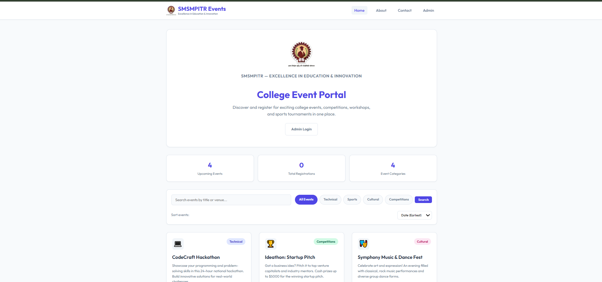
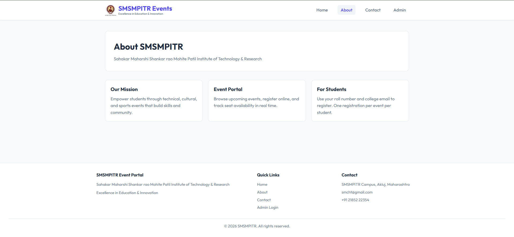
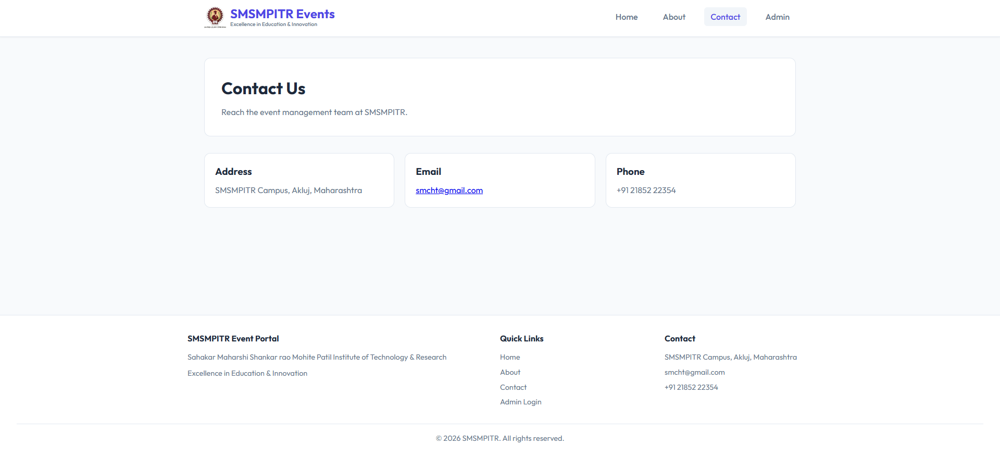
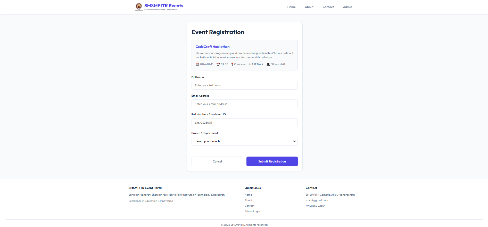
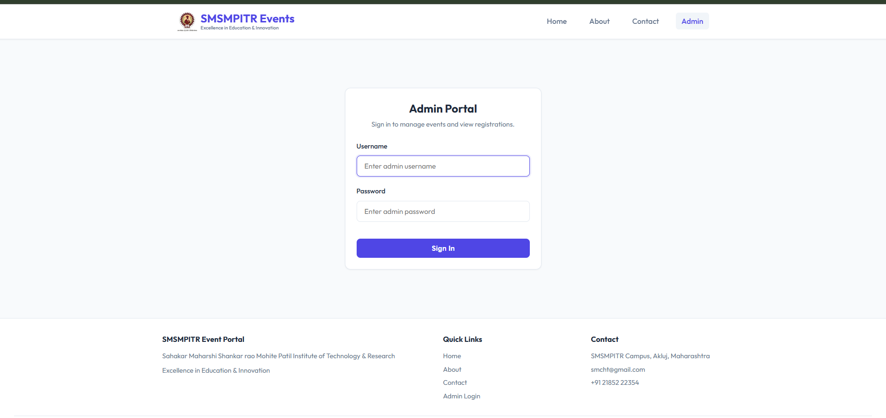
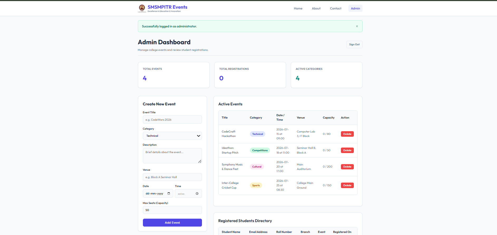

# College Event Management System

## Overview

The College Event Management System is a web application developed using Angular, Flask, and MySQL. It helps students register for college events while allowing administrators to manage events and registrations through a dedicated dashboard.

---

## Features

### Student
- View all upcoming events
- Search and filter events
- Register for events
- View event details
- Contact page

### Admin
- Secure login
- Add new events
- Delete events
- View student registrations
- Export registration data

---

## Technologies Used

### Frontend
- Angular
- HTML
- CSS
- TypeScript

### Backend
- Python
- Flask
- Flask SQLAlchemy
- Flask CORS

### Database
- MySQL

## Modules

- Home
- About
- Contact
- Event Registration
- Admin Login
- Admin Dashboard
  
## Future Enhancements

- Email Notifications
- QR Code Registration
- Online Payment
- Certificate Generation
- Student Login
- Event Analytics

## Screenshots

<h3>Home Page</h3>

<h3>About Page</h3>

<h3>Contact Page</h3>

<h3>Register Page</h3>

<h3>Admin Login Page</h3>

<h3>Admin Dashboard Page</h3>

